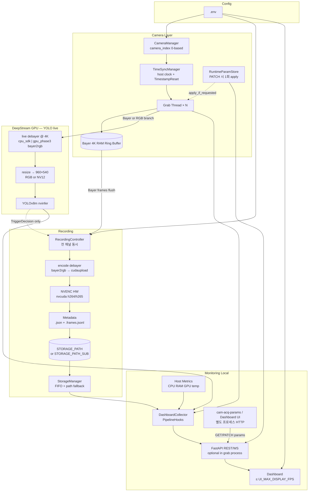

# System Architecture

구조 변경 시 본 문서와 `00_project_plan.md`를 함께 갱신한다.

## 1. 개요

| 항목 | 값 |
|------|-----|
| OS | Ubuntu 24.04 |
| GPU | RTX 4070 Ti Super 16GB |
| RAM | 32GB |
| 카메라 | 3대 (4K@23fps, 2.5GigE) |
| 시간 동기화 | **host monotonic** + `TimestampReset` 세션 앵커 (PTP 미지원) |
| AI | YOLOv8m + DeepStream nvinfer |
| Encode | NVENC HW (H.265 or H.264, Phase 4 결정) |
| 카메라 파라미터 | GenICam 런타임 PATCH (사용자 요청 시 grab 스레드 1회 반영) |

## 2. 컴포넌트 다이어그램



**녹화 vs detection 경로 (픽셀 분리)**

| 경로 | 소스 | 내용 |
|------|------|------|
| Detection | grab → **debayer @ 4K** → **resize** → YOLO | RGB/NV12; **Bayer raw는 resize하지 않음** |
| Recording | grab → **ring buffer (Bayer)** → trigger 시 flush → **encode debayer @ 4K** → NVENC | YOLO/live debayer 출력은 **녹화에 사용하지 않음** |

Bayer mosaic은 픽셀 그리드에 R/G/B가 섞여 있어 **raw 상태에서 spatial resize하면 패턴이 깨진다**.  
그래서 YOLO 경로도 항상 **demosaic(또는 bayer2rgb) 후** resize한다 (`cpu_sdk`: SDK RGB @ 4K → PIL resize; `gpu_phase3`: bayer2rgb @ 4K → videoscale).

YOLO → `RecordingController`는 `TriggerDecision`(시각·채널)만 전달한다. 영상 프레임은 ring의 Bayer raw가 encode 시점에 debayer된다 (`§3.2`).

## 3. 데이터 흐름

### 3.1 취득 → Detection

동일 RawImage(Bayer 4K)에서 **세 갈래**로 갈라진다 (픽셀 경로는 서로 독립).

```
Camera (Bayer 4K)
  → Grab Thread
  ├─ push_raw ─────────────────────────► Ring Buffer (Bayer)     ← 녹화만
  └─ detection branch:
        cpu_sdk:     SDK convert("RGB") @ 4K → PIL resize → RGB 960×540 → appsrc
        gpu_phase3:  Bayer copy → appsrc → bayer2rgb @ 4K → videoscale → 960×540 → NV12
  → YOLOv8m nvinfer (resize 해상도)
  → detection event (bbox: resize 좌표 → 4K 역변환)
```

| Debayer | 위치 | 해상도 | 용도 |
|---------|------|--------|------|
| **live** (`DEBAYER_MODE`) | grab CPU SDK 또는 DeepStream `bayer2rgb`+`videoscale` | **960×540** (`.env` `RESIZE_*`) | YOLO만 |
| **encode** (`gst_encode.py`) | trigger flush 후 GStreamer `bayer2rgb` | **Full 4K** | MP4/NVENC만 |

YOLO 경로 순서: **Bayer → debayer (4K) → resize (960×540) → nvinfer** — 순서 바꾸지 않는다.  
녹화는 ring의 Bayer를 나중에 **풀 4K로 debayer** (resize 없음).

프레임 메타: `host_recv_us` + `camera_ts_us` (카메라 tick, 1 GHz). 상세: `05_metadata_schema.md`

### 3.2 녹화 (trigger 시)

```
RAM Ring Buffer (Bayer 4K, pre+event+post)
  → appsrc (video/x-bayer)
  → bayer2rgb (GPU demosaic)        ← encode debayer; live DEBAYER_MODE와 무관
  → videoconvert → cudaupload
  → nvcudah264enc | nvcudah265enc
  → .mp4 + .json + .frames.jsonl → STORAGE_PATH (불가 시 STORAGE_PATH_SUB)
```

**Bayer를 NVENC에 직접 넣지 않는다** — raw Bayer를 압축하면 복원 시 demosaic 없이 픽셀이 깨진다.  
구현: `recording/gst_encode.py`. 3ch debayer·GPU/CPU 분산 논의: `12_debayer_3ch_strategy.md`.

녹화 pre/post window는 **호스트 monotonic** 기준 (3채널 동시 trigger). PTP 없음.

### 3.3 시간 동기화 (PTP 미사용)

현장 확인: PTP GenICam **미구현**, 4-port L2 분리 → 카메라 간 sync 불가.

| 역할 | 소스 | 용도 |
|------|------|------|
| 이벤트·녹화 경계 | host `monotonic` | detection → 전 채널 record window |
| 채널 내 순서·드랍 | `frame.timestamp` (camera tick) | healthcheck `timestamp_monotonic` |
| 세션 앵커 | `TimestampReset` + `host_t0` | 채널별 상대 0점 (`timestamp_test --reset`) |

```
세션 시작 → reset_all_timestamps() (순차) → host_t0 + (cam_i, ts0_i) 기록
프레임 수신 → host_recv_us, camera_ts_us, frame_id → .frames.jsonl
```

TimeSyncManager는 PTP를 호출하지 않는다. 상세: `09_network_topology.md`

### 3.4 카메라 파라미터 (런타임 제어)

GenICam **ExposureTime**, **ExposureAuto**, **AcquisitionFrameRate**, **Gain**, **GainAuto**, **GammaMode**, **Gamma**.  
SDK로 카메라 내부 설정 가능 (`01_sdk_feasibility.md` §3). 앱은 **사용자 PATCH 요청 시에만** grab 스레드에서 1회 `set()` (프레임마다 재적용 없음).

```
[외부] cam-acq-params / (Phase 5) Dashboard Apply
  → PATCH /api/cameras/{id}/params          ← HTTP, 별도 프로세스 가능
  → RuntimeParamStore.queue_update()          ← grab 프로세스 내
  → Grab Thread: apply_if_requested(cam)    ← 다음 루프, get_image 직전
  → GenICam feature set
  → GET .../params (last applied + apply_pending + last_apply_error)
```

| 제약 | 내용 |
|------|------|
| 프로세스 | **grab와 monitoring API 동일 프로세스** (`--with-monitoring`). gxipy는 동일 IP 이중 open 불가 |
| 단독 monitoring | `cam-acq-monitoring`만 실행 시 params API `503` (grab 미연결) |
| GigE reconnect | `feature_load` 후 store `requeue` → desired 값 재적용 |
| UI | Phase 5 별도 설정 창 (`10_monitoring_design.md` §3.1) — **미구현** |

구현: `camera/params.py`, `camera/param_store.py`, `monitoring/api.py`, CLI `cam-acq-params`.

### 3.5 Monitoring

**배포 모드**

| 모드 | 진입점 | grab 연동 | params PATCH |
|------|--------|-----------|--------------|
| 단독 | `cam-acq-monitoring` | hooks 없음 (placeholder 카메라) | ❌ |
| 통합 | `cam-acq-yolo-live --with-monitoring` 등 | `PipelineHooks` + grab 스레드 | ✅ |

통합 모드에서 FastAPI는 daemon 스레드(`monitoring/server_thread.py`)로 grab 프로세스에 붙는다.

```
Resize branch (960×540)
  → PipelineHooks / GrabStats @ 수신 FPS
HostMetricsSampler @ SYSTEM_METRICS_POLL_SEC
  → DashboardCollector → REST + WebSocket
  → Dashboard: 시스템 패널 + 카메라 그리드 @ ≤ UI_MAX_DISPLAY_FPS
```

상세: `10_monitoring_design.md`

## 4. IPC

| 경로 | 방식 |
|------|------|
| Grab → Buffer | shared memory / ring buffer |
| Detection → Recording | event queue (Python) |
| Collector → Web | in-process / WebSocket |
| Params client → Grab process | **HTTP** `GET/PATCH /api/cameras/{id}/params` (동일 호스트; 카메라 직접 open 아님) |
| Params store → Grab thread | in-process `RuntimeParamStore` + `threading.Event` (사용자 PATCH 시 1회 apply) |

## 5. 모듈 ↔ 언어

| 모듈 | 언어 |
|------|------|
| Orchestration | Python |
| TimeSyncManager | Python (host clock, TimestampReset) |
| Camera grab | Python (P1) / C (병목 시) |
| Camera params (GenICam) | Python (`params.py`, `param_store.py`) |
| Debayer / Resize / YOLO | DeepStream (C/CUDA) |
| NVENC | GStreamer/DeepStream |
| Storage / Web / params client | Python |

상세: `03_language_split.md`

## 6. 카메라 인덱스

```
camera_index 0 → CAMERA0_IP
camera_index 1 → CAMERA1_IP
camera_index 2 → CAMERA2_IP
```

인덱스는 0부터. IP last octet과 무관.

## 7. 코덱 결정 (Phase 4)

NVENC HW로 H.265 vs H.264 프로파일링 후 `.env` 확정.  
절차: `00_project_plan.md` Phase 4 §4.1

## 8. 관련 문서

| 문서 | 내용 |
|------|------|
| `01_sdk_feasibility.md` | Demosaic, SDK, timestamp, **camera params** |
| `02_streaming_design.md` | UI FPS |
| `05_metadata_schema.md` | 메타 파일, time_sync |
| `06_yolo_build_porting_guide.md` | YOLO |
| `07_storage_capacity.md` | 용량 |
| `08_ssh_healthcheck_guide.md` | 원격 검증 |
| `09_network_topology.md` | 시간 동기화, NIC |
| `10_monitoring_design.md` | Dashboard, host metrics, **params UI (§3.1)** |
| `12_debayer_3ch_strategy.md` | YOLO vs encode debayer, 3ch GPU/CPU 논의·실측 |
