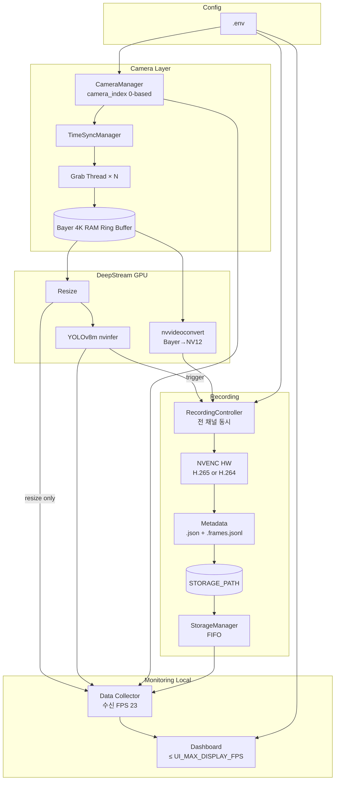

# System Architecture

구조 변경 시 본 문서와 `00_project_plan.md`를 함께 갱신한다.

## 1. 개요

| 항목 | 값 |
|------|-----|
| OS | Ubuntu 24.04 |
| GPU | RTX 4070 Ti Super 16GB |
| RAM | 32GB |
| 카메라 | 3대 (4K@23fps, 2.5GigE) |
| AI | YOLOv8m + DeepStream nvinfer |
| Encode | NVENC HW (H.265 or H.264, Phase 4 결정) |

## 2. 컴포넌트 다이어그램



## 3. 데이터 흐름

### 3.1 취득 → Detection

```
Camera (Bayer 4K)
  → Grab Thread
  → RAM Ring Buffer (pre-buffer, Bayer raw)
  → nvvideoconvert (resize branch) → YOLOv8m
  → detection event (bbox_resized → bbox_original)
```

### 3.2 녹화 (trigger 시)

```
RAM Ring Buffer (Bayer 4K, pre+event+post)
  → GPU debayer (nvvideoconvert) → NV12 4K
  → NVENC (H.265 or H.264, HW)
  → .mp4 + .json + .frames.jsonl → STORAGE_PATH
```

**Bayer를 NVENC에 직접 넣지 않는다.**

### 3.3 Monitoring

```
Resize branch (960×540)
  → Collector @ 23fps
  → WebSocket/MJPEG @ ≤ UI_MAX_DISPLAY_FPS
```

## 4. IPC

| 경로 | 방식 |
|------|------|
| Grab → Buffer | shared memory / ring buffer |
| Detection → Recording | event queue (Python) |
| Collector → Web | in-process / WebSocket |

## 5. 모듈 ↔ 언어

| 모듈 | 언어 |
|------|------|
| Orchestration | Python |
| Camera grab | Python (P1) / C (병목 시) |
| Debayer / Resize / YOLO | DeepStream (C/CUDA) |
| NVENC | GStreamer/DeepStream |
| Storage / Web | Python |

상세: `03_language_split.md`

## 6. 카메라 인덱스

```
camera_index 0 → CAMERA0_IP
camera_index 1 → CAMERA1_IP
camera_index 2 → CAMERA2_IP
```

인덱스는 0부터. IP last octet과 무관.

## 7. 코덱 결정 (Phase 4)

NVENC HW로 H.265 vs H.264 프로파일링 후 `.env` 확정.  
절차: `00_project_plan.md` Phase 4 §4.1

## 8. 관련 문서

| 문서 | 내용 |
|------|------|
| `01_sdk_feasibility.md` | Demosaic, SDK |
| `02_streaming_design.md` | UI FPS |
| `05_metadata_schema.md` | 메타 파일 |
| `06_yolo_build_porting_guide.md` | YOLO |
| `07_storage_capacity.md` | 용량 |
| `08_ssh_healthcheck_guide.md` | 원격 검증 |
